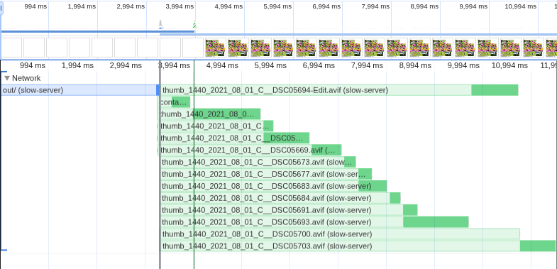
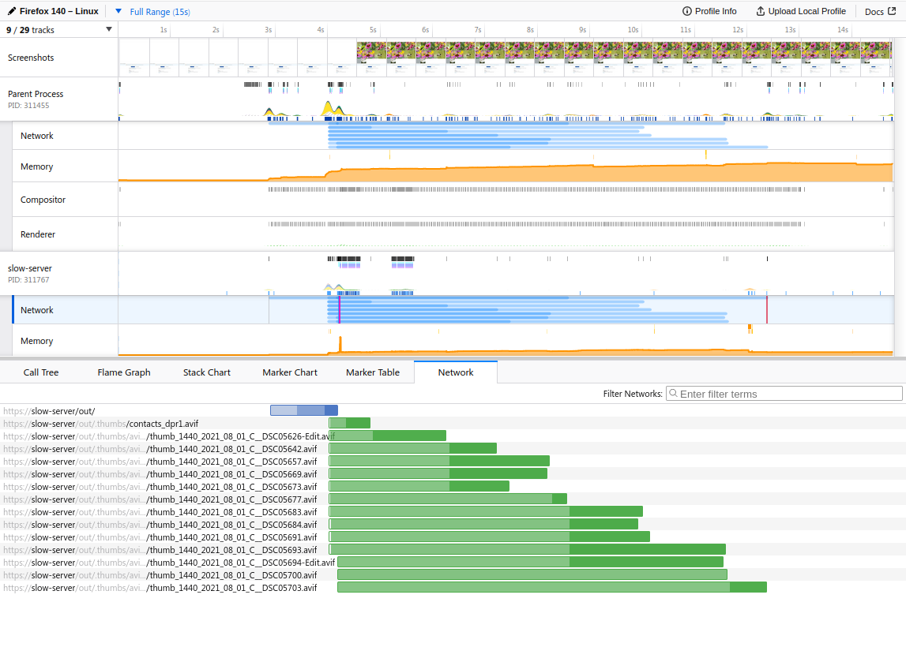

# Slow network server emulation

This directory contains a container image with Apache set up to serve the root directory of this project. TLS and HTTP2 are enabled.

**Both docker and podman are supported and function equivalently**.

The container is meant to run rootful, so that it gets its own network interface with its own IP address you can connect to from the host.

Once that is working, you can use `tc` inside the container to simulate slow networks. Traffic to general Internet or other networks is not affected.

## Why this is needed

DevTools in both Firefox and Chrome have slow network emulation, but **it's extremely inaccurate for testing content prioritization**: the browsers will still download as fast as they can, usually getting an entire stream served before the next one is requested.

Furthermore, the DevTools then fake the timing of the responses making it look like most of them were served concurrently even though they weren't and even if the server would have never done that.

As a consequence, you can get a (totally fabricated) timing of 45 seconds with DevTools network emulation when the same throttling with proper network shaping would have resulted in 5 seconds load time.

## Usage

To create the container:

```sh
## Enter this directory:
$ cd slow-server-emu

## Create a local certificate (this only needs to be done once):
## The host name in the certificate is "slow-server".
$ ./create_cert.sh  # run as a regular user
## Optional: install mkcert's local CA in your browsers.
$ mkcert -install  # run as a regular user

## Create the image:
## This will also start the container and update /etc/hosts so that "slow-server" points to the container IP.
$ sudo env ENGINE=docker ./create.sh
## This should work. If you didn't install the local CA, you can pass --insecure
$ curl -v --http2 https://slow-server/
```

`./create.sh` can be re-run at any time, in which case the older container is deleted and replaced with a new one.

Alternatively, you can start the server without recreating the container with `sudo ./start.sh`.

### Slowing down the container network

Get a shell inside the container:
```
$ sudo docker run -it slow-server bash
```

Inside the container you can do the following:
```
## List current traffic shaping rules (defaults to none):
# tc qdisc show dev eth0
qdisc noqueue 0: root refcnt 2

## Simulate 150ms latency 2560 kbit/s:
## Running this again with different numbers will change the numbers in the old rule.
# tc qdisc replace dev eth0 root netem delay 150ms rate 2560kbit

## Remove previously applied shaping rule
# tc qdisc del dev eth0 root netem
```

Of course, it's also possible to do this in one command from the host if desired:

```
docker exec -it slow-server tc qdisc replace dev eth0 root netem delay 150ms rate 2560kbit
```

## Measuring

Load the gallery in your browser: https://slow-server/out/

### Chrome

Open DevTools.

In the Network tab, click "Disable cache". Make sure have "No throttling" set. Do all throttling with `tc` in the container instead.

In the Performance tab, click *Record and Reload* or press Ctrl+Shift+E. A waterfall will be generated.



### Firefox

Open DevTools.

In the Console tab, input `document.body.innerHTML=""` to clear the page. This is optional, but necessary if you want the screenshots in the profile to be accurate -- note that Firefox doesn't blank the page on reload, which is good for end-user UX but not good for getting first-time load screenshots.

In the Network tab, click "Disable cache". Make sure have "No throttling" set. Do all throttling with `tc` in the container instead.

In the Performance tab, click "Start recording". Then press Ctrl+R to reload the page. Once the page finishes loading, press "Capture recording".

Firefox Profiler opens. Click on the "Network" track to get a waterfall chart.



### Intepreting the waterfall

Light green bars start when the request is made. Dark green represents data downloaded from the server at that time.

You want to make sure the dark green area of `contacts_` precedes the dark green area of any `thumb_` images, and that these dark green areas they don't overlap in time. That is, we should not spend any bandwidth on the bigger thumbnails before we have fully downloaded the contact sheet.

## Wireshark traffic capture

The container is already set up to run httpd with SSLKEYLOG, which is mapped to `sslkey.log` in this directory, and automatically created.

Open Wireshark, Edit/Preferences, Protocols/TLS. In "(Pre)-Master-Secret log filename" set the path to the `sslkey.log` file.

Capture on the `docker0` or `podman0` network interface.